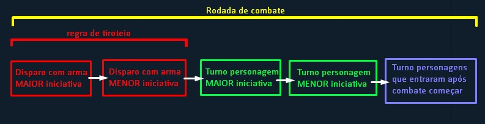

# Cenas e Tempo Narrativo

Enquanto a história é narrada pelo mestre e os personagens se aventuram pelo mundo o tempo vai passar. É extremamente importante que todos os jogadores entendam como funciona essa passagem de tempo e como ele é usado em diferentes ocasiões. **É por isso que existem as cenas**.

A primeira coisa que osjogadores precisam saber é que as cenas são subdividas com base em seu propósito. Sempre que os personagens se envolverem em alguma atividade inicia uma cena, assim que os jogares forem interrimpidos por um evento ou decidirem fazer uma nova atividade a cena se encerra, e na sequência, inicia-se uma nova cena.

# Cena de Combate

## Iniciativa

Ao inicio de um combate é utilizado o valor de DEST de cada personagem presente na cena como iniciativa para saber quem age primeiro.

Se houver empate entre personagens do mesmo lado do combate eles escolhem quem jogará primeiro

Se houver empate entre personagens de lados opostos ambos jogarão um d10, quem obter o maior valor começará primeiro.

Após essas ações serem realizadas, é organizada a rodada com os turnos de cada personagem.

#### Entrando no meio de um combate

Caso um novo personagem chegar na cena no meio de um combate, ele tera sua iniciativa na última posição da rodada, ou seja, jogará após o personagem com a iniciativa mais baixa fazer suas ações.

#### Emboscada

O grupo de personagens que forem alvos de uma emboscada recebem -10 na iniciativa

#### Regra de Tiroteio

Muitas cenas de combate envolvem a utilização de armas brancas, mas principalmente armas de fogo.

No começo da rodada, todos os personagens que possuirem e estiverem com armas de fogo em mãos podem gastar uma ação bônus(será explicada a frente no capitulo) para realizarem um disparo ou uma rajada antes do turno do jogador com maior iniciativa.

Caso mais de um personagem realize o disparo, será realizado por primeiro o disparo do personagem com maior iniciativa e assim sucessivamente, depois disso iniciará o turno do jogador com maior iniciativa.

## Ações

Durante o turno do seu personagem você pode fazer diversas ações, que dependendo de sua complexidade, demandam mais tempo do que as outras.

Por conta desse fator dividimos as ações dos personagens em 5 categorias.

<li>Movimento: usado apenas para movimentação do personagem, você consegue se mover entre as demais ações igual ao número do seu deslocamento</li>
<li>Ação padrão: ações principais do personagem, como por exemplo agarrar alguem, hackear um dispositivo ou disparar com uma arma de fogo</li>
<li>Ação bônus: ação menor que geralmente complementa a principal, como interagir com o cenário, realizar um segundo disparo ou até colocar uma bandagem em um ferimento</li>
<li>Ação livre: ações rápidas e/ou narrativas, como recarregar uma arma, sacar um item da mochila, gritar uma informação para alguem, etc... (você pode fazer várias ações livres no mesmo turno contanto que não seja uma ação repitida)</li>
<li>Reação: ação muita rápida feita durante um acontecimento, a reação acontece durante o turno de outros personagens, com ela você pode se esquivar de um disparo, se jogar no chão, aparar um golpe corpo-a-corpo e etc...(você só possuí uma reação por rodada, use com cautela!)</li>

### Movimento

Durante o seu turno, você pode se movimentar pelo cenário um numero igual ao seu deslocamento.

Você pode dividir seu movimento como bem intender entre as ações no seu turno

> Exemplo: Um personagem com 9 metros de deslocamento, pode mover-se 3metros fazer um disparo(ação padrão) correr mais 3metros jogar uma granada(ação bônus) e por fim andar mais 3 metros.

Se no mapa houver um terreno dificil seu deslocamento é reduzido pela metade ou andar nessa area

### Ação padrão

#### Ajudar

Uma das ações mais simples é prestar ajuda para
um aliado ou uma criatura. Escolha uma criatura que possa ver. Até o final do próximo turno
daquela criatura, ela realiza o próximo teste com
vantagem.

#### Atacar

#### Correr

Ao usar essa ação, você dobra seu
deslocamento até o final do
turno. Essa ação não aumenta
seu deslocamento para salto,
por exemplo, mas pode
dobrar outros tipos de deslocamento que você tenha
naturalmente 

# Cena de Desafio

    <h1 className='text-center'>
        Em construção...
    </h1>

# Cena de Exploração

Uma cena de exploração é iniciada quando os jogadores buscam um objetivo em um lugar grande com diversos desafios e recursos nos arredores como por exemplo edificios, mata fechada ou até estações espaciais.

A fim de tornar a exploração mais dinamica para os jogadores e para o preparo do mestre, foi criado o seguinte sistema.

## Funções de Exploração

Cada personagem na cena de exploração deve escolher uma Função (das citadas abaixo) baseado no que deseja fazer na cena, em seguida o jogador descreve 'como' irá fazer e cabe ao mestre decidir a perícia que o jogador utilizará. As cenas de exploração possuem 2 contadores, um contador de <b className='defense-green'>Sucesso</b> e outro contador de <b className='atack-red'>Falha</b>.

O mestre determina quantos sucessos são necessários para concluir a cena (os jogadores encontram o objetivo), e tambem aquantidade de falhas e as concequencias.

Lembrete: nem toda função contribui para aumentar o contador de <b className='defense-green'>Sucesso</b>, porem se qualquer função falhar um teste aumentará o contador de <b className='atack-red'>Falha</b>.

### Navegador

seu personagem trabalha para encontrar o destino do grupo  durante essa rodada da cena a exploração

    Se for bem sucedido no teste de perícia garante <b className='defense-green'>1 contador de sucesso</b> para a cena.

    <spam>Pode ser feito com testes em perícias de:</spam>
    <li>Investigação</li>
    <li>Engenharia civil (Para estruturas e mega-estruturas)</li>
    <li>Natureza (para areas naturais)</li>
    <li>Sobrevivência</li>
    <li>(Outras perícias que façam sentido)</li>

### Saqueador

seu personagem quer encontrar suprimentos ou itens valiosos durante essa rodada da cena de exploração

    Se for bem sucedido no teste de perícia o personagem obtém os recursos da cena de exploração de acordo com o local explorado. Se a cena for em uma floresta, o personagem encontra comida e recursos naturais, se for em uma base militar, o personagem encontraria munições ou até mesmo armas. A perícia utilizada tambem pode alterar o conteúdo do saque.

    <spam>Pode ser feito com testes em perícias de:</spam>
    <li>Percepção</li>
    <li>Crime</li>
    <li>Natureza</li>
    <li>Sobrevivência</li>
    <li>Tecnologia (para saquear informações em Data centers)</li>
    <li>(Outras perícias que façam sentido)</li>

### Guarda

seu personagem busca e alerta perigos eminentes no local de exploração, permitindo que seus aliados se concentrem em suas funções sem se preocupar com surpresas

    Um grupo sem um guarda ou caso o guarda falhe em seu teste de perícia, todos precisam passar em um teste de furtividade para não serem detectados por ameaças do local, se alguém do grupo falhar, o grupo recebe <b className='atack-red'>1 contador de falha</b> na cena. Cenas que se passam em lugares abandonados não precisam de um guarda, mas nunca se sabe...

    Personagens com a característica Alerta recebem vantagem no teste de perícia se estiverem realizando a função de guarda.

    <spam>Pode ser feito com testes em perícias de:</spam>
    <li>Percepção</li>
    <li>(Outras perícias que façam sentido)</li>

### Interceptador

seu personagem trabalha para sabotar ameaças e resolver problemas causados pelo grupo para garantir a conclusão da exploração. Entre ações como apagar câmeras, criar distrações, nocautear guardas ou até mesmo apagar rastros indevidos.

    Se for bem sucedido em seu teste de perícia remova <b className='atack-red'>1 contador de falha</b> da cena de exploração.

    <spam>Pode ser feito com testes em perícias de:</spam>
    <li>(Qualquer perícia que tenha envolvimento com a cena ou com alguma das falhas realizadas pelo grupo)</li>

### Ajudante

seu personagem vai ajudar alguém a desempenhar seu papel da melhor forma.

    Escolha outro personagem que está desempenhando uma função que não seja de ajuda

    Se for bem sucedido em um teste normal da mesma perícia que o jogador da função principal, o jogador da função principal terá vantagem no teste de perícia

    Se falhar no teste ajuda, você não vai gerar um <b className='atack-red'>contador de falha </b> na cena de exploração

    <spam>Pode ser feito com testes em perícias de:</spam>
    <li>(Mesma perícia ou perícia similar à que o jogador da função principal está realizando o teste)</li>

# Cena de Investigação

    <h1 className='text-center'>
        Em construção...
    </h1>

# Cena de Perseguição

    <h1 className='text-center'>
        Em construção...
    </h1>

# Cena de Interação social

    <h1 className='text-center'>
        Em construção...
    </h1>

# Cena de Descanso

## Descanso curto

    <h1 className='text-center'>
        Em construção...
    </h1>

## Descanso Longo

    <h1 className='text-center'>
        Em construção...
    </h1>

